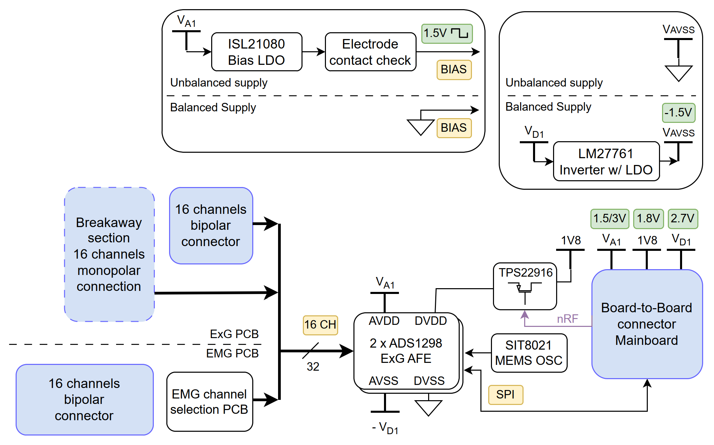

# SENSEI EMG shield

This repository contains the hardware design files for the **SENSEI EMG shield**, a versatile and modular platform designed for Electromyography (EMG) signal acquisition.

## Overview

The **SENSEI EMG Shield** simplifies EMG measurements with a flexible electrode-to-channel mapping system. Different electrode configurations can be rapidly selected by plugging interchangeable channel mapping PCBs directly onto the shield, enabling quick adaptation to different measurement scenarios.

### Key Features
- **16 EMG channels**
- Interchangeable electrode-to-channel mappings:
  - Fully differential
  - Partial electrode sharing
  - Common reference electrode montage
- Easy configuration through swappable channel-mapping PCBs
- Balanced (±1.5 V) analog operation
- Stable MEMS-based clock (±50 ppm accuracy)

## Changelog
A changelog is available in the [Changelog.md](Changelog.md) file, which tracks all major updates and revisions to the board's design and documentation.

## Contributors
- **Sebastian Frey** ([sefrey@iis.ee.ethz.ch](mailto:sefrey@iis.ee.ethz.ch))

## License
This repository makes use of the following licenses:
- for all *hardware*: Solderpad Hardware License Version 0.51
- for all *images*: Creative Commons Attribution 4.0 International
License][cc-by]

For further information have a look at the license files: `LICENSE.hw`, `LICENSE.images`